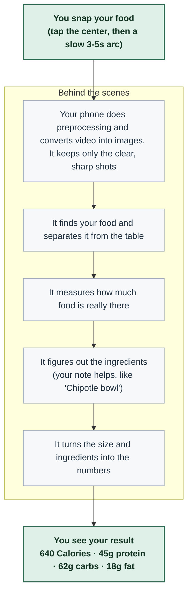
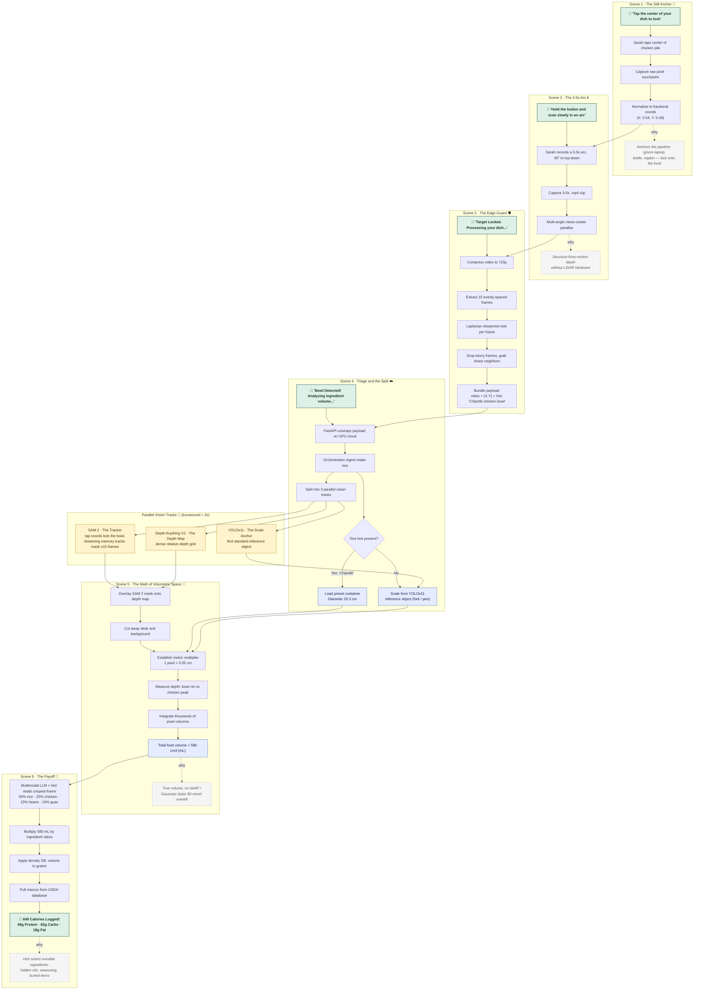

# Riva Scan — Diagrams

These diagrams live as **editable Mermaid** inside the code fences below. GitHub, VS Code
(with a Mermaid extension), Obsidian, and Notion all render them live — just edit the text
between the ` ```mermaid ` fences and the picture updates. The matching `.png` exports are
in this folder if you need a flat image.

---

## 1. How it works (plain language)



---

## 2. Detailed flow — Sarah's journey (6 scenes)

Legend: green = what Sarah sees · yellow = AI models · blue = data/metrics · gray italic = design rationale


