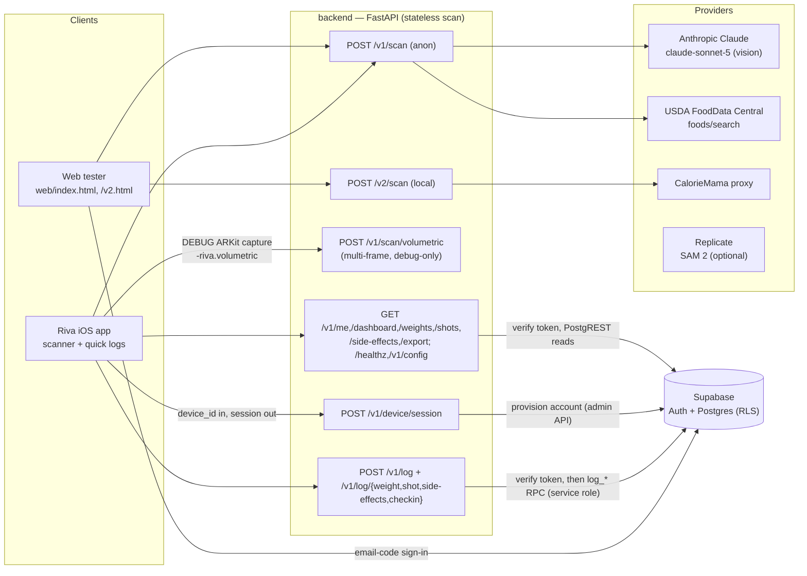
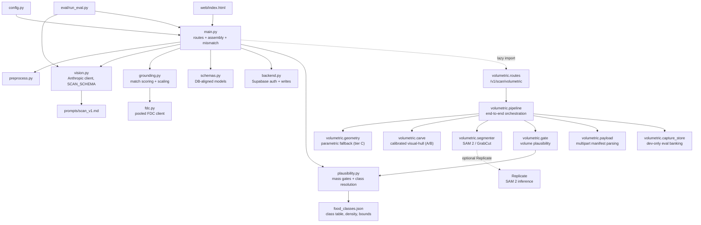

# Architecture Graph

Component and dependency graph for Riva Snap. Regenerate with /graph.

## Clients → FastAPI → providers

```mermaid
flowchart LR
    subgraph Clients
        IOS["Riva iOS app<br/>scanner + quick logs"]
        WEB["Web tester<br/>web/index.html, /v2.html"]
    end

    subgraph SVC["backend — FastAPI (stateless scan)"]
        SCAN["POST /v1/scan (anon)"]
        V2["POST /v2/scan (local)"]
        VSCAN["POST /v1/scan/volumetric<br/>(multi-frame, debug-only)"]
        LOG["POST /v1/log + /v1/log/{weight,shot,side-effects,checkin}"]
        DEV["POST /v1/device/session"]
        READS["GET /v1/me,/dashboard,/weights,/shots,<br/>/side-effects,/export; /healthz,/v1/config"]
    end

    subgraph Providers
        CLAUDE["Anthropic Claude<br/>claude-sonnet-5 (vision)"]
        FDC["USDA FoodData Central<br/>foods/search"]
        CM["CalorieMama proxy"]
        REP["Replicate<br/>SAM 2 (optional)"]
    end

    SB[("Supabase<br/>Auth + Postgres (RLS)")]

    IOS --> SCAN
    IOS --> LOG
    IOS --> READS
    IOS -- device_id in, session out --> DEV
    IOS -->|DEBUG ARKit capture<br/>-riva.volumetric| VSCAN
    WEB --> SCAN
    WEB --> V2
    WEB -- email-code sign-in --> SB
    SCAN --> CLAUDE
    SCAN --> FDC
    V2 --> CM
    LOG -- verify token, then log_* RPC (service role) --> SB
    DEV -- provision account (admin API) --> SB
    READS -- verify token, PostgREST reads --> SB
```

## Backend module dependencies

```mermaid
flowchart TD
    CFG["config.py"] --> MAIN["main.py<br/>routes + assembly + mismatch"]
    MAIN --> PRE["preprocess.py"]
    MAIN --> VIS["vision.py<br/>Anthropic client, SCAN_SCHEMA"]
    MAIN --> GRO["grounding.py<br/>match scoring + scaling"]
    GRO --> FDCC["fdc.py<br/>pooled FDC client"]
    MAIN --> SCH["schemas.py<br/>DB-aligned models"]
    MAIN --> BE["backend.py<br/>Supabase auth + writes"]
    MAIN --> PL["plausibility.py<br/>mass gates + class resolution"]
    PL --> FC["food_classes.json<br/>class table, density, bounds"]
    VIS --> PR["prompts/scan_v1.md"]
    
    MAIN -.->|lazy import| VR["volumetric.routes<br/>/v1/scan/volumetric"]
    VR --> VP["volumetric.pipeline<br/>end-to-end orchestration"]
    VP --> VG["volumetric.geometry<br/>parametric fallback (tier C)"]
    VP --> VC["volumetric.carve<br/>calibrated visual-hull (A/B)"]
    VP --> VS["volumetric.segmenter<br/>SAM 2 / GrabCut"]
    VS -.->|optional Replicate| REPP["Replicate<br/>SAM 2 inference"]
    VP --> VGT["volumetric.gate<br/>volume plausibility"]
    VGT --> PL
    VP --> VPAY["volumetric.payload<br/>multipart manifest parsing"]
    VP --> VSTORE["volumetric.capture_store<br/>dev-only eval banking"]
    
    EVAL["eval/run_eval.py"] --> VIS
    EVAL --> MAIN
    WEBT["web/index.html"] --> MAIN
```
